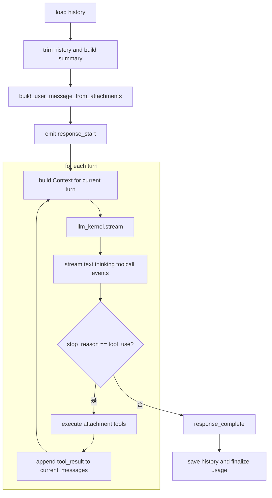

# chat_with_kernel_gptassistant Core Flow

## Mermaid



## Plain Text

```text
chat_with_kernel_gptassistant
  -> load history
  -> trim history
  -> older history -> summary -> system prompt
  -> build_user_message_from_attachments
     -> inject attachment manifest and tool guidance
     -> attach native images when supported
  -> emit response_start
  -> for each turn
     -> build Context(system_prompt + current_messages + tools)
     -> call llm_kernel.stream
     -> stream text / thinking / toolcall events
  -> if stop_reason != tool_use
     -> response_complete
  -> if stop_reason == tool_use
     -> execute attachment tools
     -> append tool_result into context
     -> continue next stream round
  -> response_complete
  -> save history and finalize usage
```

## Key Files

- Main orchestration: `servers/assistant-bff/app/chat_kernel_service.py`
- Attachment preprocessing: `servers/assistant-bff/app/attachments/service.py`
- Attachment tools: `servers/assistant-bff/app/attachments/tools.py`
- Provider stream bridge: `servers/assistant-bff/app/llm_kernel/providers/openai_compat.py`
