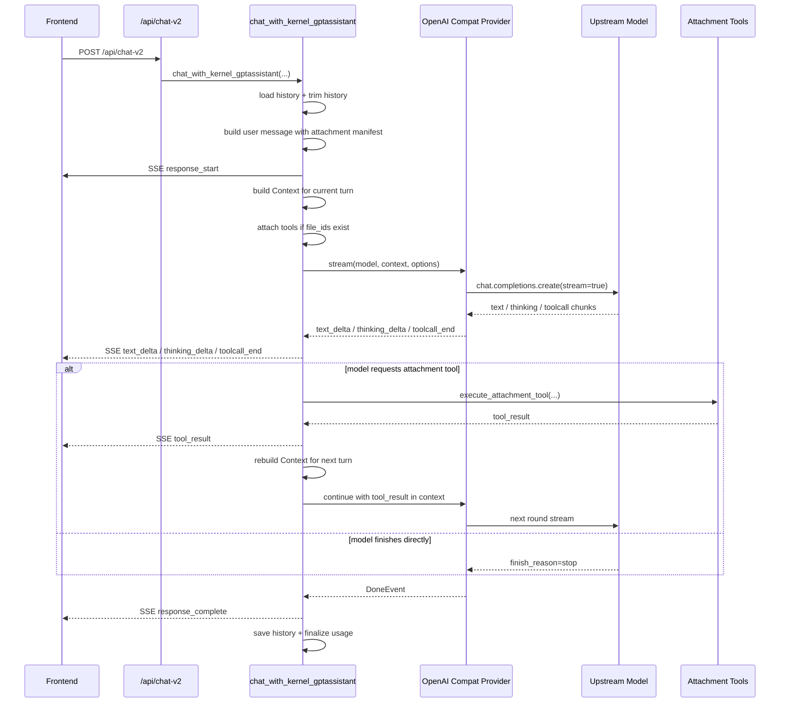

# chat-v2 Tool-First Sequence

## Mermaid



## Plain Text

```text
Frontend
  -> POST /api/chat-v2

Route
  -> 鉴权
  -> 选模型
  -> 进入 chat_with_kernel_gptassistant

Kernel
  -> 加载历史
  -> 裁剪历史
  -> 把附件清单和工具提示注入 user message
  -> 如果模型支持原生图片输入，直接把图片作为 image block 挂上
  -> 如果有附件，直接把 attachment tools 暴露给模型
  -> 发出 response_start

Provider
  -> 组装 OpenAI-compatible messages / tools
  -> 请求上游模型流式返回

Model
  -> 要么直接返回文本
  -> 要么先请求 document_list / document_read_text / document_load_images

如果模型触发 tool call
  -> BFF 执行附件工具
  -> 返回 tool_result
  -> 把 tool_result 追加回 context
  -> 再继续下一轮模型调用

最后
  -> response_complete
  -> 保存 history
  -> 前端结束当前消息渲染
```
